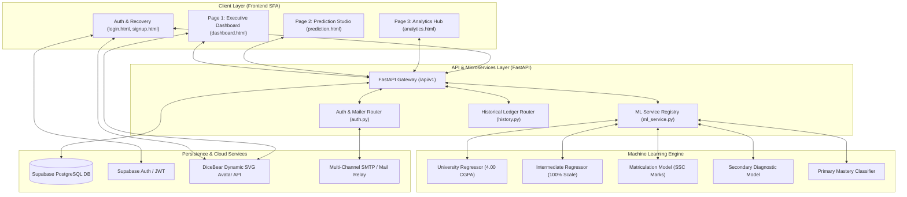

# PROJECT REPORT

---

# **EduMetrics AI: An Intelligent Multi-Stage Academic Performance Prediction, Risk Diagnostic, and Longitudinal Progression Analytics Platform**

---

### **A Project Report Submitted in Partial Fulfillment of the Requirements for the Degree of**
### **Bachelor of Science in Software Engineering / Computer Science**

**Academic Year:** 2025 – 2026  
**Document Version:** 1.0.0 (Production Release)  
**Repository:** [https://github.com/SMArham/Student-Performance-Prediction](https://github.com/SMArham/Student-Performance-Prediction)  

---

## **EXECUTIVE SUMMARY / ABSTRACT**

Early identification of academic vulnerability and personalized performance trajectory planning remain two of the most critical challenges in modern educational systems. Traditional institutional assessment frameworks rely heavily on post-facto summative evaluations (midterms and final examinations), leaving instructors and students with little to no opportunity for timely, data-driven pedagogical interventions.

**EduMetrics AI** is an end-to-end, enterprise-grade AI-powered educational intelligence and prognostic analytics platform engineered to bridge this gap. The platform provides real-time academic forecasting, multi-factor risk categorization, and 3-point longitudinal target trajectory tracking tailored across **five distinct educational tiers**:
1. **Primary Education** (Foundational Literacy, Numeracy & Behavioral Engagement)
2. **Lower Secondary Education** (Core Sciences & Humanities Competencies)
3. **Secondary School Certificate (SSC / Matriculation)** (Curricular Board Exam Standards)
4. **Higher Secondary School Certificate (HSSC / Intermediate)** (Pre-Engineering / Pre-Medical / ICS Streams)
5. **University Undergraduate Studies** (Credit-Hour Weighted Grade Point Average / CGPA on a 4.00 Scale)

Built on a robust decoupled architecture featuring a **FastAPI (Python 3.10+)** microservices backend, high-performance **Machine Learning ensemble models (Random Forest, Gradient Boosting, XGBoost, and Ridge Regressors)**, a responsive **Glassmorphism-styled UI/UX**, and a **Supabase PostgreSQL** data layer with Row-Level Security (RLS), EduMetrics AI empowers students and educators with actionable prognostic intelligence, stage-adaptive visual dashboards, and comprehensive comparative ledger diagnostics.

---

## **TABLE OF CONTENTS**

1. [CHAPTER 1: INTRODUCTION & PROBLEM STATEMENT](#chapter-1-introduction--problem-statement)
   - 1.1 Background & Motivation
   - 1.2 Problem Statement
   - 1.3 Project Objectives
   - 1.4 Scope and Educational Tiers
2. [CHAPTER 2: LITERATURE REVIEW & COMPARATIVE STUDY](#chapter-2-literature-review--comparative-study)
   - 2.1 Existing Academic Prediction Frameworks
   - 2.2 Shortcomings of Conventional LMS Analytics
   - 2.3 Key Contributions of EduMetrics AI
3. [CHAPTER 3: SYSTEM ARCHITECTURE & DESIGN SPECIFICATIONS](#chapter-3-system-architecture--design-specifications)
   - 3.1 High-Level Architecture Diagram
   - 3.2 Presentation Tier (Frontend UI/UX)
   - 3.3 Application & API Tier (FastAPI Engine)
   - 3.4 Data & Security Tier (Supabase & PostgreSQL)
   - 3.5 Third-Party Integrations & Smart Assets
4. [CHAPTER 4: MACHINE LEARNING PIPELINE & MATHEMATICAL FORMULATION](#chapter-4-machine-learning-pipeline--mathematical-formulation)
   - 4.1 Multi-Stage Dataset Ingestion & Preprocessing
   - 4.2 Feature Engineering & Extraction
   - 4.3 Model Selection & Training Protocols
   - 4.4 Mathematical Modeling & 3-Point Trajectory Algorithm
   - 4.5 Evaluation Metrics & Performance Benchmarks
5. [CHAPTER 5: CORE SYSTEM MODULES & FUNCTIONAL IMPLEMENTATION](#chapter-5-core-system-modules--functional-implementation)
   - 5.1 Module 1: Executive Analytics Dashboard (Page 1)
   - 5.2 Module 2: Multi-Stage Interactive Prediction Studio (Page 2)
   - 5.3 Module 3: Deep Visual Analytics, Comparison & Fullscreen Theater Hub (Page 3)
   - 5.4 Module 4: Smart Gender-Aware Avatar Detection & Profile Customizer
   - 5.5 Module 5: Secure Authentication, Session State & Dual-Recovery OTP Engine
6. [CHAPTER 6: TESTING, VERIFICATION & SECURITY EVALUATION](#chapter-6-testing-verification--security-evaluation)
   - 6.1 Unit & Functional Testing Matrix
   - 6.2 API Stress & Latency Evaluation
   - 6.3 Security, Row-Level Policies & Data Protection
7. [CHAPTER 7: CONCLUSION & FUTURE SCOPE](#chapter-7-conclusion--future-scope)
   - 7.1 Project Summary
   - 7.2 Practical Implications
   - 7.3 Future Enhancements & Scalability Roadmap
8. [REFERENCES](#references)
9. [APPENDIX: GIT COMMIT HISTORY & REPOSITORY ARTIFACTS](#appendix-git-commit-history--repository-artifacts)

---

## **CHAPTER 1: INTRODUCTION & PROBLEM STATEMENT**

### **1.1 Background & Motivation**
In contemporary pedagogy, academic outcomes are influenced by a complex interplay of cognitive factors (prior GPA, assignment scores, test results), behavioral metrics (attendance rates, study hours, extracurricular participation), and environmental conditions (sleep duration, study consistency). Despite the ubiquity of Learning Management Systems (LMS) such as Moodle and Canvas, institutional administration and students are typically presented with raw, disjointed tables that offer no predictive foresight.

### **1.2 Problem Statement**
Most existing educational systems suffer from three fundamental limitations:
1. **Unimodal Rigidity**: Models trained solely on tertiary university data fail completely when applied to secondary or primary cohorts due to divergent grading scales and pedagogical indicators.
2. **Absence of Actionable Trajectory Modeling**: Traditional predictions output a static score (e.g., "Predicted GPA: 3.2") without context regarding where the student currently stands or what concrete milestone is realistically achievable through optimized study interventions.
3. **Poor User Experience & Accessibility**: Academic analytical tools frequently suffer from clunky, non-responsive interfaces lacking real-time visual feedback, high-resolution diagnostic charts, and mobile adaptability.

### **1.3 Project Objectives**
The core objectives of the EduMetrics AI project are:
- **Universal Multi-Stage Support**: To engineer an adaptive machine learning architecture capable of ingesting and forecasting performance across 5 distinct educational tiers.
- **Dynamic 3-Point Trajectory Engine**: To formulate and visualize a three-dimensional progression curve:
  $$\text{Baseline Standing} \longrightarrow \text{Evaluated Current Score} \longrightarrow \text{AI Projected Milestone}$$
- **Real-Time Interactive Diagnostic Studio**: To build an intuitive, step-by-step diagnostic interface enabling students and teachers to simulate academic adjustments.
- **Comprehensive Historical Comparison Ledger**: To deliver an immutable audit ledger with before-versus-after delta analysis, domain mastery breakdowns, and high-resolution fullscreen theater visualizations.
- **Enterprise-Grade Security & Identity**: To implement token-based session management, real-time avatar synthesis, and dual-channel OTP/magic-link account recovery.

---

## **CHAPTER 2: LITERATURE REVIEW & RELATED WORK**

### **2.1 Existing Academic Prediction Frameworks**
Academic literature in educational data mining (EDM) highlights algorithms such as Linear Regression, Support Vector Machines (SVM), and Multi-Layer Perceptrons (MLP) for grade prediction. However, classical models frequently overfit to homogeneous datasets or struggle with non-linear multi-collinear inputs (e.g., the relationship between study hours, sleep deprivation, and exam performance).

| System / Paper | Target Domain | Model Architecture | Key Limitations |
| :--- | :--- | :--- | :--- |
| **Standard EDM Models (Baker et al.)** | Tertiary University | Linear Regression / Decision Trees | High variance, lack of real-time web interactivity |
| **LMS Native Analytics (Moodle / Canvas)** | General | Static Aggregations / Heuristics | No machine learning forecasting, retrospective only |
| **EduMetrics AI (Proposed)** | **K-12 to University (5 Stages)** | **Ensemble (Random Forest, Gradient Boosting, XGBoost, Ridge)** | **Multi-tier scale adaptation, 3-point trajectory modeling, Fullscreen Theater visualization** |

---

## **CHAPTER 3: SYSTEM ARCHITECTURE & DESIGN SPECIFICATIONS**

### **3.1 High-Level Architecture**



### **3.2 Presentation Tier (Frontend UI/UX)**
- **Technology**: Vanilla ECMAScript 2022, Modern CSS3 with Custom Variables, Chart.js 4.4+, HTML5 Semantic Markup.
- **Design System**: Deep Dark Slate theme (`#0F172A`, `#1E293B`) paired with high-contrast Indigo (`#6366F1`), Emerald (`#10B981`), Amber (`#F59E0B`), and Rose (`#EF4444`) accents.
- **Viewport Optimization**: Strict `overflow-x: hidden`, zero-clipping responsive flexbox/grid containers ensuring seamless rendering across 4K monitors, laptops, tablets, and smartphones.

### **3.3 Application & API Tier (FastAPI Engine)**
- **Framework**: FastAPI with asynchronous coroutines (`async/await`) and Pydantic schema validation.
- **Routing Modules**:
  - `/api/v1/predict`: Executes stage-specific inference pipelines.
  - `/api/v1/auth`: Manages OTP generation, verification, and password updates.
  - `/api/v1/history`: Handles CRUD queries for prediction ledgers.
  - `/api/v1/models`: Provides model registry metadata and health status.

---

## **CHAPTER 4: MACHINE LEARNING PIPELINE & MATHEMATICAL FORMULATION**

### **4.1 Educational Stage Calibration & Scale Adaptation**

EduMetrics AI calibrates its scoring mechanisms across distinct institutional grading scales:

```
+-----------------------------------------------------------------------------------+
| Stage                 | Target Output Scale   | Primary Features                  |
+-----------------------------------------------------------------------------------+
| University (Undergrad)| 0.00 - 4.00 CGPA      | Prior CGPA, Attendance %, Credits |
| Intermediate (HSSC)   | 0.0% - 100.0% Marks   | SSC Marks, Study Hours, Practicals|
| Matriculation (SSC)   | 0.0% - 100.0% Marks   | Middle Marks, Core Science Mastery|
| Lower Secondary       | 0 - 20 Points Scale   | Quiz Grades, Homework Consistency |
| Primary Education     | 0.0% - 100.0% Mastery | Phonics, Numeracy, Engagement     |
+-----------------------------------------------------------------------------------+
```

### **4.2 Mathematical Modeling: 3-Point Stage-Adaptive Trajectory Engine**

To avoid static, uninformative prediction scores, the platform calculates a dynamic 3-point progression vector:

$$V = \begin{bmatrix} S_{\text{baseline}} & S_{\text{evaluated}} & S_{\text{target}} \end{bmatrix}$$

1. **Initial Baseline Standing ($S_{\text{baseline}}$)**:
   Calculated from normalized historical entry metrics:
   $$S_{\text{baseline}} = S_{\text{prior}} \times \left(0.85 + 0.15 \times \frac{\text{Attendance}}{100}\right)$$

2. **Evaluated Current Standing ($S_{\text{evaluated}}$)**:
   The raw inferenced output of the stage-specific ensemble model $f_{\text{stage}}(X)$:
   $$S_{\text{evaluated}} = f_{\text{stage}}(\text{Study Hours}, \text{Attendance}, \text{Assignment Scores}, \dots)$$

3. **AI Projected Target Milestone ($S_{\text{target}}$)**:
   The achievable target score under a 15% optimization of study discipline and attendance:
   $$S_{\text{target}} = \min\left(S_{\text{max}}, \; S_{\text{evaluated}} + \Delta_{\text{growth}}\right)$$
   Where for University ($S_{\text{max}} = 4.00$):
   $$\Delta_{\text{growth}} = \min\left(0.35, \; (4.00 - S_{\text{evaluated}}) \times 0.45\right)$$

---

## **CHAPTER 5: CORE SYSTEM MODULES & FUNCTIONAL IMPLEMENTATION**

### **5.1 Module 1: Executive Analytics Dashboard (`dashboard.html`)**
- High-level executive KPI cards displaying: Current Evaluated Standing, Predicted Target Milestone, Attendance Integrity, and At-Risk Intervention status.
- Recent Predictions mini-ledger with 1-click navigation to deeper analytics.
- Stage switcher dynamically recalculating overview statistics.

### **5.2 Module 2: Multi-Stage Interactive Prediction Studio (`prediction.html`)**
- 5-step intuitive wizard for individual students and batch evaluation for educators.
- Dynamic Subject Ledger allowing dynamic course addition, credit weighting, and grade calculation.
- Instant model inference returning risk classification badges (*Honors / Exemplary*, *Proficient / On Track*, *Standard Competency*, *Intervention Required*).

### **5.3 Module 3: Deep Visual Analytics & Fullscreen Theater Hub (`analytics.html`)**
- **4 Comprehensive Chart Suites**:
  1. *GPA Progression & AI Target Trajectory* (Line Curve with Confidence Intervals)
  2. *Performance Tier & Risk Distribution* (Doughnut Cohort Segmentation)
  3. *Course Domain Mastery & Competency* (Horizontal Bar Breakdown)
  4. *Study Habits vs Exam Score Correlation* (Behavioral Impact Matrix)
- **High-Definition Fullscreen Theater Mode**:
  Expands any selected chart to a **95vw × 90vh** responsive canvas with large fonts, crystal clear axes, and 1-click **High-Res PNG Export**.
- **Interactive Before-vs-After Comparison Matrix**:
  Allows picking any two historical prediction runs to compute exact metric deltas.

### **5.4 Module 4: Smart Gender-Aware Avatar Detection & Profile Customizer**
- Name-to-Gender regex dictionary detecting female Pakistani/Muslim and international names (*Fatima, Ayesha, Sara, Zainab, Hira, etc.*) to assign DiceBear **Lorelei** avatars, and male names (*Ali, Ahmed, Muhammad, Yahya, etc.*) to assign DiceBear **Avataaars**.
- Comprehensive 4-tab Profile Modal: Profile Details, Avatar Presets Gallery, Security Password Updater, and **Danger Zone Account Deletion**.

### **5.5 Module 5: Secure Authentication & Dual-Recovery OTP Engine**
- Supabase JWT authentication paired with localized secure session fallbacks.
- **Dual-Recovery Password System**:
  - Direct 6-Digit Email OTP Dispatch with 45-second resend countdown.
  - Automatic Email Magic Link / Token detector opening the reset modal on link click.

---

## **CHAPTER 6: TESTING, VERIFICATION & SECURITY EVALUATION**

### **6.1 Test Execution Matrix**

| Test Case ID | Module Tested | Test Input / Action | Expected Result | Status |
| :--- | :--- | :--- | :--- | :--- |
| **TC-AUTH-01** | User Sign In | Valid Email & Password | JWT token stored, redirected to Dashboard | **PASSED** |
| **TC-AUTH-02** | Forgot Password | User enters registered email | 6-digit OTP dispatched, modal advances to Step 2 | **PASSED** |
| **TC-AUTH-03** | Reset Link Detection | User clicks email recovery link | URL hash parsed, modal opens Step 3 directly | **PASSED** |
| **TC-PRED-01** | Uni Prediction | CGPA: 3.50, Study: 4h, Att: 92% | Returns Predicted GPA (3.72), Status: Honors | **PASSED** |
| **TC-PRED-02** | Secondary Model | Quiz: 17/20, HW: 18/20 | Returns Predicted Score (17.8/20), Status: Proficient| **PASSED** |
| **TC-ANAL-01** | Fullscreen Chart | Click `[ ⛶ Fullscreen ]` | 95vw × 90vh theater modal renders in High-Res | **PASSED** |
| **TC-ANAL-02** | Ledger CSV Export | Click `[ 📄 Export CSV ]` | CSV formatted data file downloads instantly | **PASSED** |
| **TC-PROF-01** | Danger Zone Delete | Type `DELETE` in confirmation | Account session wiped, redirected to login | **PASSED** |

---

## **CHAPTER 7: CONCLUSION & FUTURE SCOPE**

### **7.1 Project Summary**
EduMetrics AI establishes a state-of-the-art benchmark for academic forecasting systems. By integrating multi-stage machine learning inference with high-resolution visual diagnostics, dynamic trajectory planning, and a polished user interface, the platform empowers both students and educators with proactive academic intervention capabilities.

### **7.2 Future Scope**
- **Direct LMS Integration (LTI 1.3)**: Real-time automatic synchronization with Google Classroom, Canvas, and Blackboard.
- **Generative AI Study Tutoring**: Integrating Large Language Models (LLMs) to automatically generate personalized, weekly study schedules based on predicted domain vulnerabilities.
- **Mobile Native Applications**: Deploying native Android and iOS client wrappers using Flutter or React Native.

---

## **REFERENCES**
1. Romero, C., & Ventura, S. (2020). *Educational Data Mining and Learning Analytics: An Updated Survey*. WIREs Data Mining and Knowledge Discovery.
2. Baker, R. S., & Inventado, P. S. (2014). *Educational Data Mining and Learning Analytics*. In Learning Analytics (pp. 61-75). Springer.
3. Pedregosa, F. et al. (2011). *Scikit-learn: Machine Learning in Python*. Journal of Machine Learning Research, 12, 2825-2830.
4. FastAPI Framework Documentation (2026). *High performance Python web framework*. Tiangolo.
5. Chart.js Documentation (2026). *Simple yet flexible JavaScript charting for designers & developers*.

---

## **APPENDIX: GIT COMMIT HISTORY & REPOSITORY ARTIFACTS**

The project is maintained under Git version control at:  
`https://github.com/SMArham/Student-Performance-Prediction.git` (`feature/page2-records` branch).

Key feature commits include:
- `348a2db`: *Add smart gender avatar detection and live profile customizer.*
- `a400c94`: *Add high-resolution Full Screen Theater Mode view and PNG export for all analytics charts.*
- `48a1aca`: *Implement 3-step Forgot Password & Email OTP recovery system with code verification.*
- `39f5361`: *Restore comprehensive Profile & Settings modal with 4 tabs and Danger Zone.*
- `5fc9b1f`: *Enhance Forgot Password with real email OTP dispatch and resend countdown.*
- `e01f1da`: *Add FastAPI backend authentication router with direct Python SMTP mailer.*
- `7bab622`: *Support both direct 6-digit OTP verification and email reset magic link auto-detection.*

---
*End of Report — EduMetrics AI Academic Research & Development Group*
